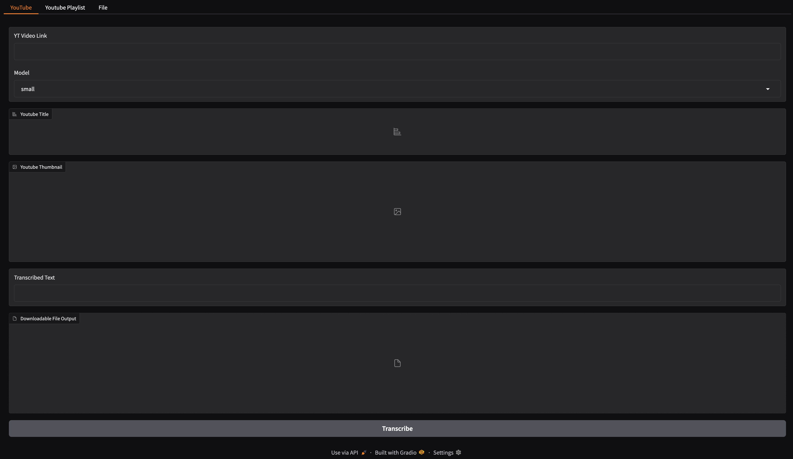
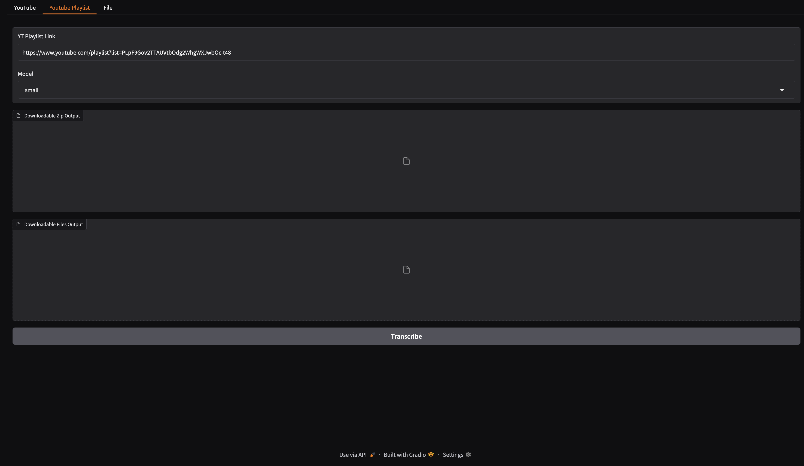
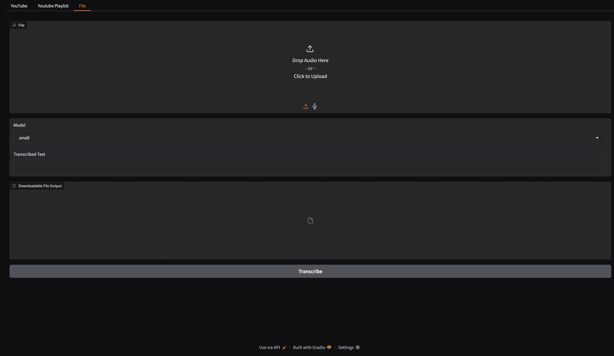

# Whisper UI with YT


| :exclamation:  The Python script is designed for MacOS or Linux, as are all the commands provided   |
|-----------------------------------------------------------------------------------------------------|

## Purpose

My mom wanted to transcribe some videos from YouTube, and she bought some subscription to do it. However, the YouTube Functionality wasn't great, so I tried to install some WebUIs for whisper on my server. None of them had functionality for YouTube playlists, so I decided to attempt this. As stated above, it is mainly for YouTube playlists.

## Features:

- YouTube Playlist transcription
- YouTube Video transcription
- Local File transcription

## Install

### Python
1. Clone repo and enter repo dir

   ```bash
   git clone https://github.com/luemonkey123/whisper-ui-with-yt-playlist.git
   cd whisper-ui-with-yt-playlist
   ```
   
2. Create a Python 12 venv

   ```bash
   python3.12 -m venv .venv
   ```

3. Activate the venv

   ```bash
   source .venv/bin/activate
   ```

5. Install dependencies

   ```bash
   python3 -m pip install -r requirements.txt
   ```

7. Run main.py

   ```bash
   python3 main.py
   ```

## Roadmap

- [ ] test

## Screenshots


